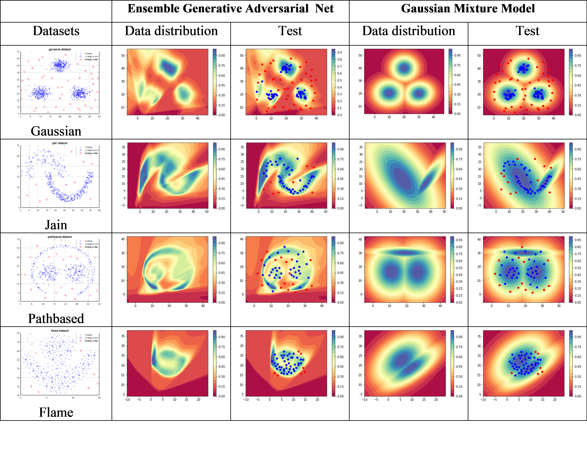
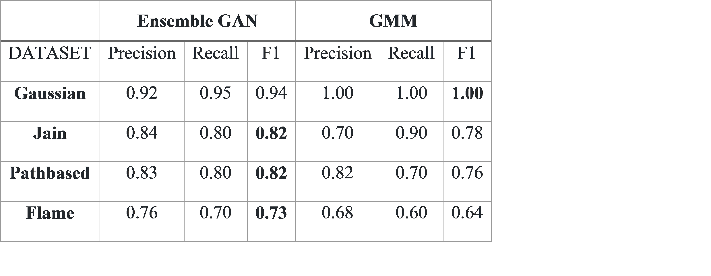

# Ensemble GANs for Anomaly Detection

> Wenlong "Waylon" Wu, University of Missouri

### Abstract

Generative Adversarial Networks (GANs) has achieved great success in modeling data distributions on images. The GANs algorithm is extended on the structure data in this project to model the structure data distributions and then to detect the anomalies that are out of the data distributions. Single GANs architecture has limited ability to approximate the data distributions due to the lack of modes the enerator creates. The averaging ensemble method is employed in this project to combine the local spatial data distributions of each single GANs creates. The ensemble GANs, along with the Gaussian Mixture Model (GMM), is run on one synthetic dataset and three benchmark clustering datasets and has shown superior performance on approximating data distributions of structure data and on detecting anomalies than
the single GANs and the GMM.

The data distribution visualization plot is shown in blow:

The numerical evaluation is shown in below table:

Check out the attached report pdf for more information.

*PyTorch framework is used in this project.*

